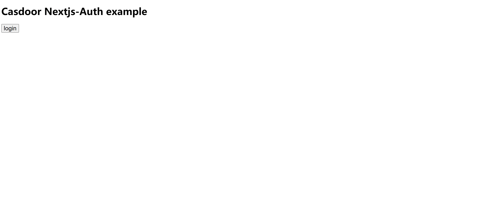

nextjs-auth
=======

A Next.js example for Casdoor SSO.

Live demo: https://nextjs-auth.casdoor.org

## Demo video



## Configuration

The default [config.js](app/conf.js) points to the Casdoor demo site. Change it to your own Casdoor: 

```js
const sdkConfig = {
  serverUrl: "https://door.casdoor.com",
  clientId: "294b09fbc17f95daf2fe",
  organizationName: "casbin",
  appName: "app-vue-python-example",
  redirectPath: "/callback",
}

export default sdkConfig;
```

## Getting started

run the development server:

```bash
yarn dev
```

Open [http://localhost:3000](http://localhost:3000) with your browser to see the result.
